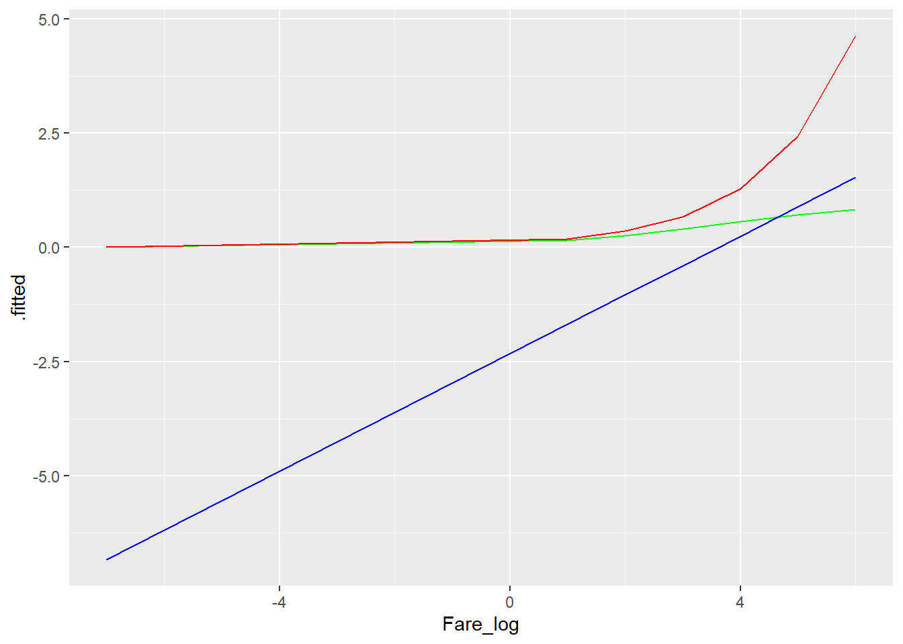

# Statistics
## Logistic Regression 
*[Markdown Tutorial](https://bookdown.org/yihui/rmarkdown/html-document.html)*


 
     

### Matematyczna interpretacja modelu

Quiz correct answers: d. Hint: `Remember`, the coefficient in a logistic regression model is the expected increase in the log odds given a one unit increase in the explanatory variable.


| Survived|    Fare| Fare_log|
|--------:|-------:|--------:|
|        0|  7.2500|        2|
|        1| 71.2833|        4|
|        1|  7.9250|        2|
|        1| 53.1000|        4|
|        0|  8.0500|        2|
|        0|  8.4583|        2|
Wyliczanie modelu logistycznego.

```r
model <- glm(data=df_titanic, Survived ~ Fare_log, family = 'binomial')

tidy(model)  %>% kable(caption='Table 1. Summary statistics for logistic regression model')
```


Table: (\#tab:unnamed-chunk-2)Table 1. Summary statistics for logistic regression model

|term        |   estimate| std.error| statistic| p.value|
|:-----------|----------:|---------:|---------:|-------:|
|(Intercept) | -2.3337286| 0.2452271| -9.516601|       0|
|Fare_log    |  0.6442428| 0.0792358|  8.130706|       0|
Model wyliczany jest zgodnie z ponizsza formula
{#id .class width=50% height=50%}

dlategp by otrzymac oszacowania paraemtrow w formie ich wpływu na odds musimy je poddać działaniu exp()

{#id .class width=50% height=50%}


```r
coef(model)
```

```
## (Intercept)    Fare_log 
##  -2.3337286   0.6442428
```

```r
#Tak przemnozone wspolczynniki interpretujemy nastepujaco:
#  o ile % wzrosnie odds wystapienia zdarzenia jezeli wzrosnie nam wartosc predyktora o 1

exp(coef(model))
```

```
## (Intercept)    Fare_log 
##  0.09693365  1.90454431
```
Ponizej w sposob matematyczny pokazuje ze to wlasnie oznacza interpretacja wzrostu parametra stajacego przy predyktorze.

```r
df_aug <- augment(model, type.predict = "response") # without response argument, the fitted value will be on log-odds scale

p3 = df_aug$.fitted[df_aug$Fare_log==3][1]
p2 = df_aug$.fitted[df_aug$Fare_log==2][1]

x <- round(p3/(1-p3)/(p2/(1-p2)),5)

# i sprawdzenie czy dobrze rozumiem zależnosc
x1<-round(exp(coef(model))['Fare_log'],5)
x1==x
```

```
## Fare_log 
##     TRUE
```

Prob for Fare_log = 2 was equal to 0.2601396 while for Fare_log = 3 was equal to 0.401072. The odds increase by 1.90454. The same what model results suggests -> 1.90454.


Quiz

The fitted coefficient from the medical school logistic regression model is 5.45. The exponential of this is 233.73.

Donald's GPA is 2.9, and thus the model predicts that the probability of him getting into medical school is 3.26%. The odds of Donald getting into medical school are 0.0337, or—phrased in gambling terms—29.6:1. If Donald hacks the school's registrar and changes his GPA to 3.9, then which of the following statements is FALSE:

Possible Answers

  a)  His expected odds of getting into medical school improve to 7.8833 (or about 9:8).
  b)  His expected probability of getting into medical school improves to 88.7%.
  c)  His expected log-odds of getting into medical school improve by 5.45.
  d)  His expected probability of getting into medical school improves to 7.9%.

Correct answers on the top of the page

### Graficzna interpretacja modelu


{#id .class width=50% height=50%}

{#id .class width=50% height=50%}


```r
df_aug %>% mutate(Survived_hat=round(.fitted)) %>%
  select(Survived, Survived_hat) %>% table
```

```
##         Survived_hat
## Survived   0   1
##        0 462  83
##        1 219 123
```

```r
#Out of sample predictions
DiCaprio<-data.frame(Fare_log=1)
augment(model, newdata = DiCaprio, type.predict = 'response')
```

```
## # A tibble: 1 x 2
##   Fare_log .fitted
##      <dbl>   <dbl>
## 1        1   0.156
```
